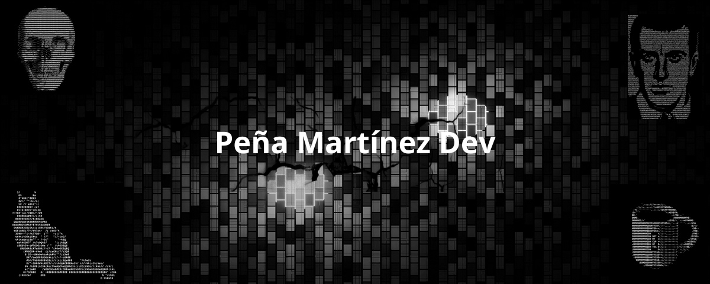

# Sobre mí
### ¡Hola! Soy Leonardo Peña, un apasionado desarrollador web especializado en el stack MERN (MongoDB, Express, React y Node.js). Con una sólida experiencia en la creación de aplicaciones web robustas y escalables, siempre busco mantenerme al día con las últimas tendencias y tecnologías del desarrollo web.

### Además de mi experiencia técnica, también soy un gestor de proyectos (PM), con un enfoque particular en la metodología Kanban. Mi habilidad para organizar y liderar equipos ha sido clave en la entrega exitosa de múltiples proyectos, asegurando siempre la eficiencia y la calidad.

# Aquí están algunas de mis competencias clave:

### Desarrollo Full Stack: Diseño y desarrollo de aplicaciones utilizando el stack MERN.

### Metodología Kanban: Gestión de proyectos con un enfoque en la mejora continua y la optimización del flujo de trabajo.

### Colaboración en equipo: Fomento de un ambiente de trabajo colaborativo y eficiente, liderando equipos multidisciplinarios.

### Innovación y aprendizaje continuo: Pasión por aprender nuevas tecnologías y mejorar constantemente mis habilidades.

### Estoy siempre en busca de nuevos desafíos y oportunidades para crecer tanto profesional como personalmente. ¡No dudes en contactarme para colaborar en futuros proyectos o simplemente para conectar!

